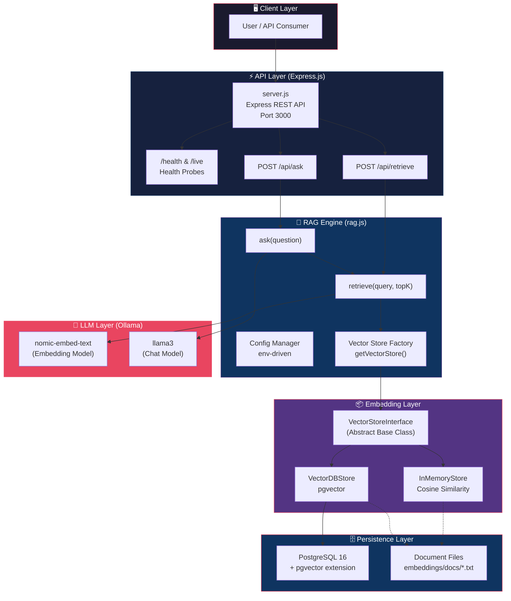
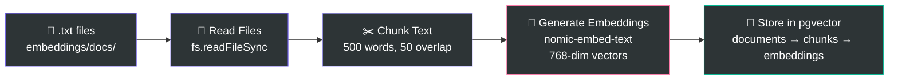
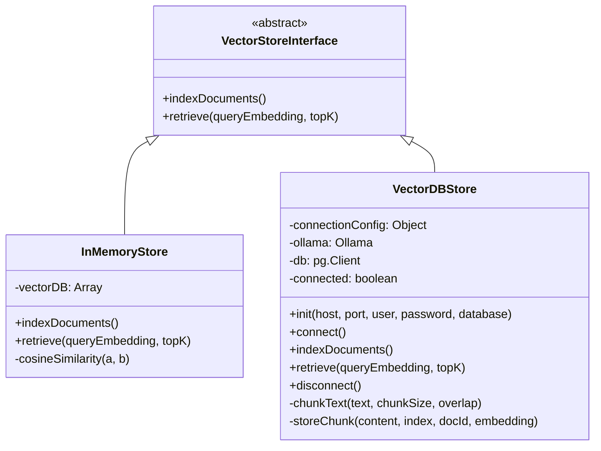
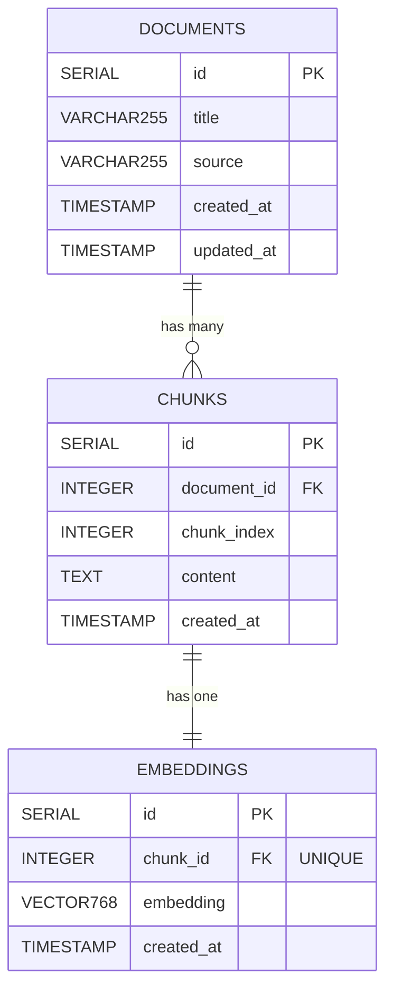
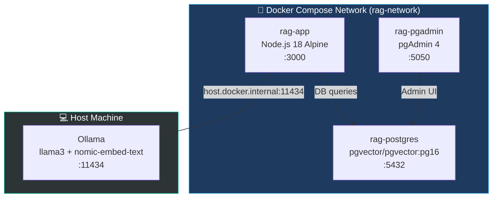
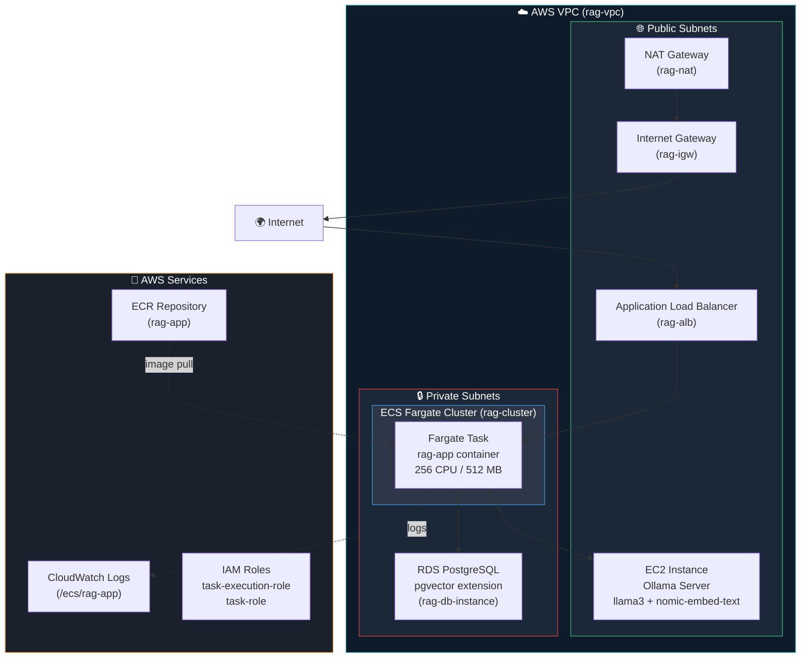
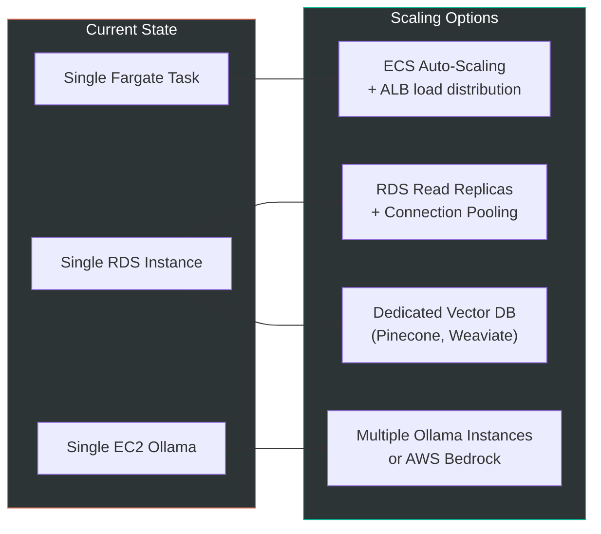
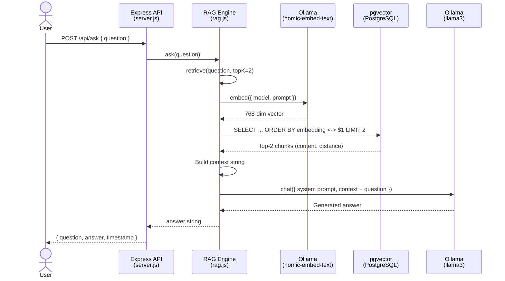

# RAG System — System Design Document

## 1. Overview

This is a **Retrieval-Augmented Generation (RAG)** system for **Insurance Policy Q&A**. It ingests insurance policy documents, chunks and embeds them into a vector store, and at query time retrieves the most semantically relevant chunks to ground an LLM's answer — eliminating hallucinations and ensuring factual responses.

**Core value proposition:** Users can ask natural-language questions about insurance policies and get accurate, context-grounded answers backed by source documents.

---

## 2. High-Level Architecture



---

## 3. Data Flow Pipelines

### 3.1 Indexing Pipeline (Offline — `npm run seed`)

This pipeline runs **once** to ingest documents into the vector store.



**Steps:**
1. **Read** — Scan `embeddings/docs/` for `.txt` files
2. **Create Document Record** — Insert into `documents` table (title, source)
3. **Chunk** — Split text into 500-word chunks with 50-word overlap
4. **Embed** — Generate 768-dimensional vectors via `nomic-embed-text` (Ollama)
5. **Store** — Insert chunks into `chunks` table, embeddings into `embeddings` table

### 3.2 Query Pipeline (Online — `POST /api/ask`)

This pipeline runs on **every user question**.


**Steps:**
1. **Embed Query** — Convert user question to 768-dim vector via `nomic-embed-text`
2. **Vector Search** — Use pgvector's `<->` (L2 distance) operator to find nearest chunks
3. **Retrieve Top-K** — Return top 2 most similar chunks (configurable)
4. **Augment Prompt** — Inject retrieved context into a system prompt
5. **Generate** — Send augmented prompt to `llama3` via Ollama chat API
6. **Return** — Stream answer back to client as JSON

---

## 4. Component Breakdown

### 4.1 API Layer — [server.js](file:///Users/pankajdewangan/work/genAI-and-agenticAI/RAG/server.js)

| Endpoint | Method | Purpose |
|---|---|---|
| `/` | GET | API info & endpoint listing |
| `/health` | GET | Health check (status, timestamp, version) |
| `/live` | GET | Liveness probe for ECS/K8s |
| `/api/ask` | POST | Full RAG pipeline — question in, answer out |
| `/api/retrieve` | POST | Retrieval only — returns relevant context chunks |

- Graceful shutdown via `SIGTERM` / `SIGINT` handlers
- JSON error handling middleware
- Configurable port via `API_PORT` env var

### 4.2 RAG Engine — [rag.js](file:///Users/pankajdewangan/work/genAI-and-agenticAI/RAG/rag.js)

Core orchestration module with two exported functions:

- **`retrieve(query, topK)`** — Embeds query → searches vector store → returns context string
- **`ask(question)`** — Calls `retrieve()` → constructs prompt → calls LLM → returns answer

Uses a **factory pattern** (`getVectorStore()`) to swap between `inMemory` and `vectorDB` backends.

### 4.3 Embedding Layer — [embeddings/](file:///Users/pankajdewangan/work/genAI-and-agenticAI/RAG/embeddings)



| Store | Backend | Similarity | Use Case |
|---|---|---|---|
| `InMemoryStore` | JS Array | Cosine similarity (manual) | Development / Testing |
| `VectorDBStore` | PostgreSQL + pgvector | L2 distance (`<->` operator) | Production |

### 4.4 LangChain Variants — [langchain/](file:///Users/pankajdewangan/work/genAI-and-agenticAI/RAG/langchain)

Three alternative implementations using LangChain framework:

| Version | File | Approach | Key Difference |
|---|---|---|---|
| Base | `langchain-rag.js` | `PGVectorStore` + `asRetriever` | Direct LLM invoke, hardcoded docs |
| v1 | `langchain-rag_v1.js` | `RetrievalQAChain` | Uses deprecated chain API, file loading |
| v2 | `langchain-rag_v2.js` | LCEL (`RunnablePassthrough`) | Modern LangChain Expression Language |

All three use `RecursiveCharacterTextSplitter` (1000 chars, 200 overlap) and `MemoryVectorStore`.

---

## 5. Database Schema



**Key design decisions:**
- **Normalized schema** — Documents → Chunks → Embeddings (1:N:1 relationship)
- **CASCADE deletes** — Deleting a document removes all its chunks and embeddings
- **IVFFlat index** on `embedding` column for fast approximate nearest-neighbor search
- **768-dimension vectors** — matching `nomic-embed-text` output dimensionality

---

## 6. Deployment Architecture

### 6.1 Local Development (Docker Compose)



### 6.2 AWS Production Architecture



**AWS Resource Map:**

| Resource | Service | Config |
|---|---|---|
| Container Runtime | ECS Fargate | 256 CPU, 512 MB RAM |
| Container Registry | ECR | `rag-app:latest` |
| Database | RDS PostgreSQL | pgvector extension, `vectordb` |
| LLM Server | EC2 | Ollama with llama3 + nomic-embed-text |
| Load Balancer | ALB | Target group: `rag-tg` |
| Networking | VPC | Public + Private subnets, NAT Gateway |
| Logging | CloudWatch | `/ecs/rag-app` log group |
| Security | IAM | Task execution + task roles |
| Security Groups | EC2 SGs | `rag-alb-sg`, `rag-fargate-sg`, `rag-rds-sg`, `rag-ollama-sg` |

---

## 7. Technology Stack

| Layer | Technology | Purpose |
|---|---|---|
| **Runtime** | Node.js 18 (Alpine) | Application runtime |
| **API Framework** | Express.js 4.x | REST API server |
| **LLM** | Ollama (llama3) | Text generation |
| **Embeddings** | Ollama (nomic-embed-text) | 768-dim vector embeddings |
| **Vector DB** | PostgreSQL 16 + pgvector | Vector similarity search |
| **DB Client** | node-pg | PostgreSQL driver |
| **LLM Framework** | LangChain (alternative impl.) | RAG chain orchestration |
| **Containerization** | Docker (multi-stage build) | Application packaging |
| **Orchestration** | Docker Compose / ECS Fargate | Container orchestration |
| **Process Manager** | dumb-init | Signal forwarding in containers |

---

## 8. Design Patterns & Principles

| Pattern | Where | How |
|---|---|---|
| **Strategy Pattern** | `VectorStoreInterface` | Swap between InMemory and VectorDB backends via factory |
| **Factory Pattern** | `getVectorStore()` in rag.js | Env-driven store instantiation |
| **Template Method** | `VectorStoreInterface` base class | Abstract methods enforced on subclasses |
| **12-Factor App** | Config via env vars | All config externalized via `.env` / env vars |
| **Multi-stage Docker Build** | Dockerfile | Smaller image, no dev dependencies in prod |
| **Graceful Shutdown** | server.js SIGTERM/SIGINT | Clean process termination |
| **Health Check Pattern** | `/health` + `/live` endpoints | Container orchestrator integration |
| **Separation of Concerns** | server.js ↔ rag.js ↔ embeddings/ | API, orchestration, and storage are decoupled |

---

## 9. Scalability Considerations



| Bottleneck | Current Limit | Scaling Path |
|---|---|---|
| **API Throughput** | Single Fargate task | ECS service auto-scaling behind ALB |
| **Vector Search** | pgvector on RDS | Dedicated vector DB (Pinecone/Weaviate) at 10M+ vectors |
| **LLM Inference** | Single EC2 Ollama | GPU instances, multiple replicas, or AWS Bedrock |
| **Embedding Generation** | Synchronous, single-threaded | Batch processing, queue-based indexing |
| **DB Connections** | Single `pg.Client` per request | Connection pooling (`pg.Pool`) |

---

## 10. Request Lifecycle — End-to-End



---

## 11. File Structure Summary

```
RAG/
├── server.js                          # Express API — entry point
├── rag.js                             # RAG engine — retrieve + ask
├── package.json                       # Dependencies & scripts
├── Dockerfile                         # Multi-stage production build
├── docker-compose-aws.yml             # Full-stack Docker Compose
├── .env.aws                           # AWS environment template
├── task-definition.json               # ECS Fargate task definition
├── cleanup.sh                         # AWS resource teardown script
│
├── embeddings/
│   ├── VectorStoreInterface.js        # Abstract base class
│   ├── inMemory.js                    # In-memory store (dev)
│   ├── vectorDB.js                    # pgvector store (prod)
│   ├── README.md                      # Embedding architecture docs
│   └── docs/                          # Source documents
│       ├── annuity.txt
│       ├── games.txt
│       └── policy.txt
│
├── pg-vector/
│   ├── init.sql                       # DB schema + pgvector setup
│   ├── docker-compose.yml             # Standalone pgvector compose
│   └── postgres-data/                 # Persistent volume
│
├── langchain/                         # Alternative LangChain implementations
│   ├── langchain-rag.js               # Base — PGVectorStore
│   ├── langchain-rag_v1.js            # v1 — RetrievalQAChain
│   └── langchain-rag_v2.js            # v2 — LCEL (modern)
│
└── scripts/
    └── seed.js                        # Document indexing script
```
